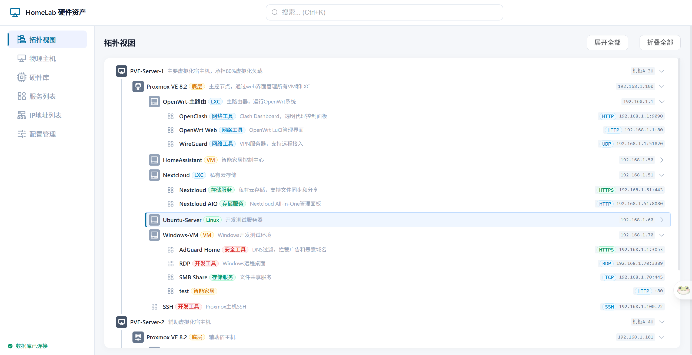
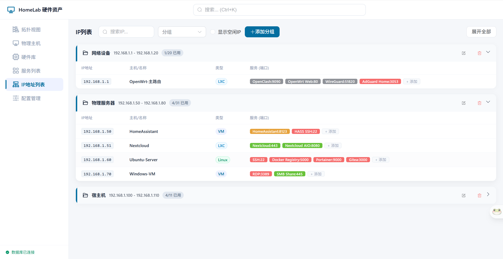
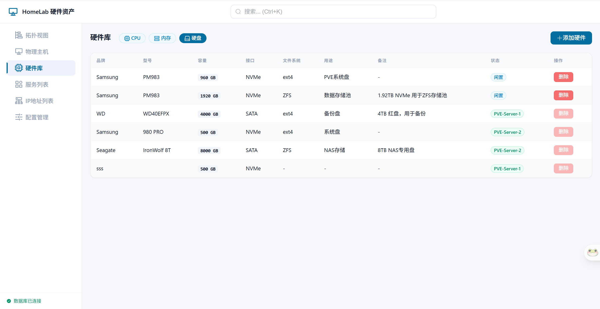
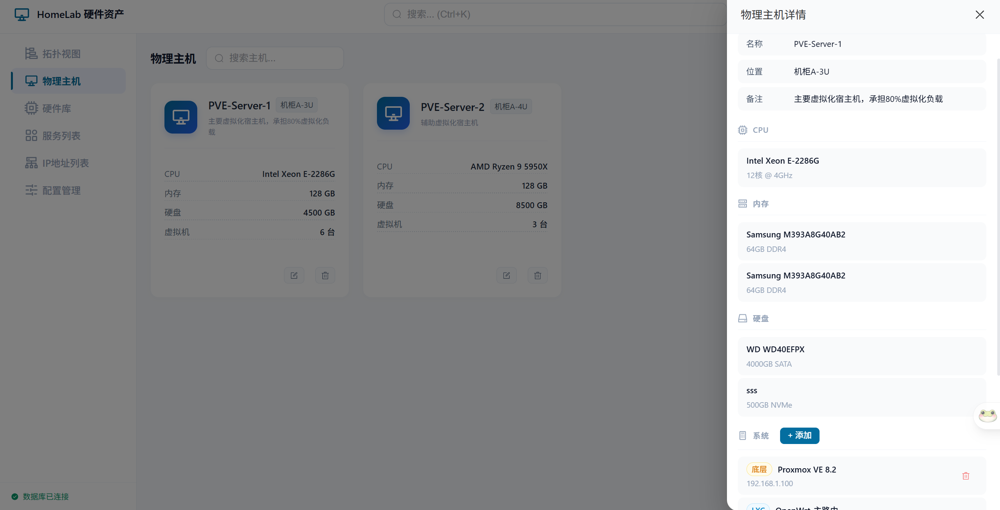

# HomeLab 硬件资产管理系统

<div align="center">

[](https://github.com/Tsenghan/homelab-hardware-manager)
[](https://github.com/Tsenghan/homelab-hardware-manager/blob/main/LICENSE)
[](https://hub.docker.com/r/tsenghan/homelab-manager)

*专为个人及 HomeLab 场景设计的硬件与虚拟化资产管理系统*

</div>

---

## 功能特性

### 核心管理

| 功能 | 说明 |
|------|------|
| **物理主机管理** | 添加、编辑、删除物理服务器，关联位置与备注信息 |
| **硬件库** | 统一管理未分配的 CPU、内存、硬盘，支持批量录入 |
| **OS 实例** | 支持 PVE/ESXi/Linux/Windows/LXC 等类型，可嵌套展示 VM/LXC |
| **服务管理** | 管理端口、协议、服务地址，一键跳转访问 |

### 可视化与交互

| 功能 | 说明 |
|------|------|
| **拓扑视图** | 树形结构展示 `物理机 → OS实例 → 服务` 的完整层级关系 |
| **全局搜索** | 跨层级模糊匹配，支持服务名、IP、硬件型号等快速定位 |
| **抽屉式详情** | 点击节点右侧滑出详情面板，保持上下文不丢失 |
| **IP 列表** | 按分组展示 IP 分配情况，直观管理地址段 |
| **配置管理** | 自定义 OS 类型和服务协议的名称与配色方案 |

### 数据模型

```
L1 硬件层     → Computer / CPU / RAM / Disk
L2 系统层     → OsInstance（支持嵌套 VM/LXC）
L3 应用层     → Service
```

---

## 界面预览

| 拓扑视图 | IP 列表 |
|:---:|:---:|
|  |  |

| 服务列表 | 配置管理 |
|:---:|:---:|
|  |  |

---

## 快速开始

### Docker 部署（推荐）

```bash
git clone https://github.com/Tsenghan/homelab-hardware-manager.git
cd homelab-hardware-manager
docker-compose up -d
```

访问 **http://your-server:5000** 即可。

> 首次启动自动创建示例数据。

### 本地开发

**前端**
```bash
cd frontend
npm install --legacy-peer-deps
npm run dev
```

**后端**（另起终端）
```bash
cd backend
pip install -r requirements.txt
python main.py
```

访问 http://localhost:5173，Vite 自动代理 `/api` 到 Flask。

---

## 部署

### Docker Compose

```bash
docker-compose up -d      # 启动
docker-compose pull       # 拉取最新镜像
docker-compose up -d      # 更新并重启
docker-compose logs -f   # 查看日志
docker-compose down       # 停止
```

### 数据持久化

数据库文件存储在 `data/` 目录（主机挂载），删除该目录后重启容器将重新初始化。

---

## 项目结构

```
homelab-hardware-manager/
├── frontend/
│   ├── src/
│   │   ├── views/          # 页面组件
│   │   ├── components/      # 公共组件
│   │   │   └── details/    # 详情抽屉组件
│   │   ├── stores/         # 状态管理
│   │   ├── api/            # API 接口封装
│   │   └── router/         # 路由配置
│   ├── public/
│   └── vite.config.js
├── backend/
│   ├── routes/             # API 路由
│   │   ├── computers.py
│   │   ├── os_instances.py
│   │   ├── services.py
│   │   ├── ip_groups.py
│   │   ├── search.py
│   │   └── type_configs.py
│   ├── main.py             # Flask 入口
│   ├── models.py           # 数据模型
│   ├── init_db.py         # 数据库初始化
│   └── requirements.txt
├── screenshots/           # 界面截图
├── docker-compose.yml
└── nginx.conf              # Nginx 反向代理配置（可选）
```

---

## API 接口

| 方法 | 路径 | 说明 |
|------|------|------|
| GET | `/api/computers` | 获取主机列表 |
| POST | `/api/computers` | 创建主机 |
| PUT | `/api/computers/<id>` | 更新主机 |
| DELETE | `/api/computers/<id>` | 删除主机 |
| GET | `/api/os-instances` | 获取 OS 实例列表 |
| POST | `/api/os-instances` | 创建 OS 实例 |
| DELETE | `/api/os-instances/<id>` | 删除 OS 实例 |
| GET | `/api/services` | 获取服务列表 |
| POST | `/api/services` | 创建服务 |
| PUT | `/api/services/<id>` | 更新服务 |
| DELETE | `/api/services/<id>` | 删除服务 |
| GET | `/api/ip-groups` | 获取 IP 分组 |
| POST | `/api/ip-groups` | 创建 IP 分组 |
| PUT | `/api/ip-groups/<id>` | 更新 IP 分组 |
| DELETE | `/api/ip-groups/<id>` | 删除 IP 分组 |
| GET | `/api/type-configs` | 获取配置项 |
| POST | `/api/type-configs` | 创建配置项 |
| GET | `/api/search?q=` | 全局搜索 |
| POST | `/api/import` | 导入数据 |
| GET | `/api/export` | 导出数据 |

---

## 技术栈

| 层级 | 技术 |
|------|------|
| 前端 | Vue 3 + Composition API + Vite + Element Plus + icon-park |
| 后端 | Python Flask + Flask-SQLAlchemy |
| 数据库 | SQLite |
| 部署 | Docker + Docker Compose |

---

## 参与开发

### 环境要求

- Node.js >= 18
- Python >= 3.10
- Docker & Docker Compose（可选）

### 开发流程

1. Fork & Clone
2. 安装依赖：`cd frontend && npm install --legacy-peer-deps`
3. 启动后端：`cd backend && pip install -r requirements.txt && python main.py`
4. 启动前端：`cd frontend && npm run dev`
5. 提交规范：`feat:` `fix:` `refactor:` `style:` `docs:`

---

## 许可证

[MIT License](LICENSE)

---

## 关于 AI

本项目从零到一由 AI 辅助构建。

感谢 **Claude Code (Anthropic)** 和 **MiniMax M2.7**。
